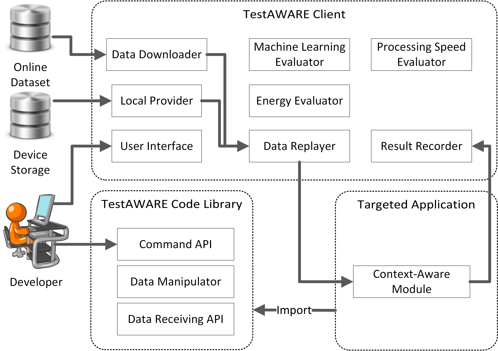
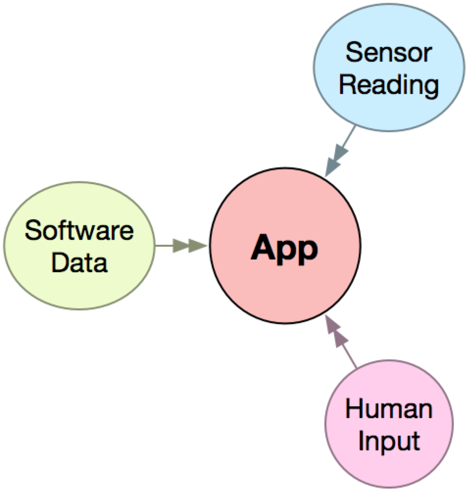
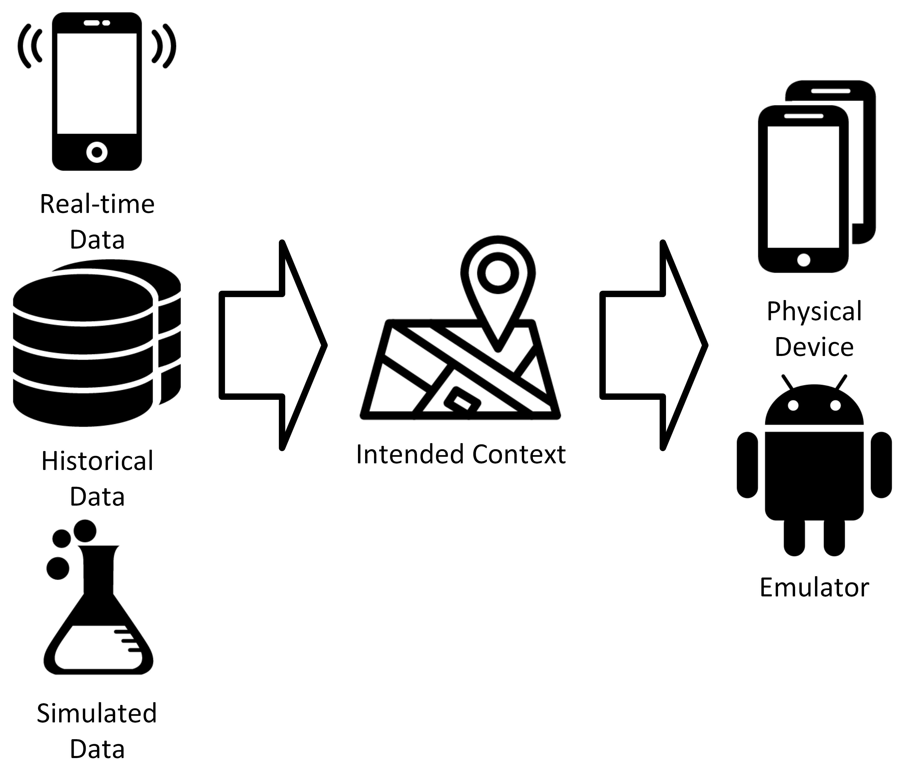

# TestAWARE
The testing tool

Android Project

2016 version

TestAWARE is a laboratory-oriented testing tool for mobile context-aware applications.
It enables developers to systematically test context-aware applications in laboratory settings.
It can be installed on Android devices.

TestAWARE can read and replay data recorded by AWARE (http://www.awareframework.com/).
AWARE is a data collection and manager for mobile contextual data.
Data types can be hardware, software and human input.
TestAWARE can also replay Audio data in wav.

Also, testers can combine real-time and manipulated data.

The replay simply sends data via Android Intent.

The basic controls are simple. You can run tests without coding.

If you are interested in the mechanisms, please read the paper [1].

Dependencies:
http://www.awareframework.com/

https://glados.kis.agh.edu.pl/doku.php?id=pub:software:contextsimulator:start

Citation:
[1] Chu Luo, Miikka Kuutila, Simon Klakegg, Denzil Ferreira, Huber Flores, Jorge Goncalves, Mika Mäntylä and Vassilis Kostakos. 2017. TestAWARE: A Laboratory-Oriented Testing Tool for Mobile Context-Aware Applications. Proceedings of the ACM on Interactive, Mobile, Wearable and Ubiquitous Technologies (IMWUT) , 1, 3, Article 80 (September 2017), 29 pages. URL: https://doi.org/10.1145/3130945

